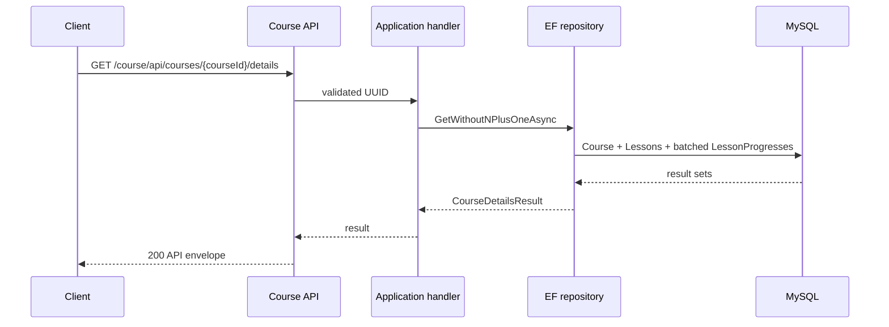

# `GET /course/api/courses/{courseId}/details`

Business flow: [Lấy chi tiết Course](../../../business-flows/courses/get-course-details.md).

## Mục đích

Trả Course, toàn bộ Lessons theo `displayOrder` và toàn bộ Progress của mỗi
Lesson. Direct path là `GET /api/courses/{courseId}/details`; endpoint chỉ đọc,
safe và idempotent.



## Yêu cầu

`courseId` là UUID bắt buộc. Không có request body hoặc query parameter.

## Phản hồi thành công

```json
{
  "data": {
    "id": "course-uuid",
    "name": "Backend Fundamentals",
    "status": "PUBLISHED",
    "createdAtUtc": "2026-08-19T01:00:00Z",
    "lessons": [{
      "id": "lesson-uuid",
      "title": "Introduction",
      "displayOrder": 1,
      "progresses": [{ "studentId": "student-uuid", "progressPercent": 50, "completedAtUtc": null, "updatedAtUtc": "2026-08-19T02:00:00Z" }]
    }]
  },
  "meta": { "traceId": "01J..." }
}
```

## Hiệu năng và N+1

Endpoint luôn gọi `GetWithoutNPlusOneAsync`: tối đa ba query bất kể số Lesson:
Course, toàn bộ Lesson, toàn bộ `lesson_progresses WHERE lesson_id IN (...)`.
Repository cũng giữ `GetWithNPlusOneAsync` chỉ cho benchmark; method này cố ý
query Progress từng Lesson và không được API gọi. Không bật EF Lazy Loading.

## Mã trạng thái

- `200`: Course tồn tại, kể cả Course chưa có Lesson/Progress.
- `404 COURSE_NOT_FOUND`: Course không tồn tại.
- `400`: `courseId` không phải UUID hợp lệ.

Không thay đổi database hoặc publish message.

## Ví dụ gọi

```bash
curl --request GET \
  --header 'X-Correlation-ID: trace-course-details-001' \
  'http://localhost:5100/course/api/courses/<course-uuid>/details'
```

## Khắc phục sự cố

| Hiện tượng | Nguyên nhân thường gặp | Cách xử lý |
| --- | --- | --- |
| `400 VALIDATION_FAILED` | `courseId` rỗng hoặc không đúng UUID. | Dùng UUID hợp lệ, không dùng `Guid.Empty`. |
| `404 COURSE_NOT_FOUND` | Course không tồn tại trong Course Service. | Kiểm tra lại ID hoặc tạo Course trước. |
| `lessons`/`progresses` rỗng | Course chưa có Lesson hoặc Lesson chưa có progress. | Đây là phản hồi hợp lệ `200`; không phải lỗi API. |
