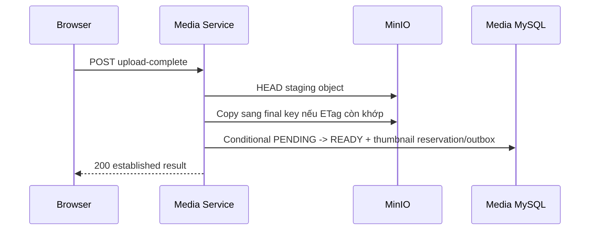

# `POST /media/api/media/{mediaId}/upload-complete`

Business flow: [`post-media-direct.md`](../../../business-flows/media/post-media-direct.md).

## Mục đích

Media Service xác minh staging object của một upload intent và hoàn tất media
draft thành `READY`. Public path là
`POST /media/api/media/{mediaId}/upload-complete`; direct service path là
`POST /api/media/{mediaId}/upload-complete`.

## Kiến trúc



## Xác thực, ownership và yêu cầu

JWT chưa được triển khai; request dùng convention tạm thời và chỉ hỗ trợ
`STUDENT`. Media không tồn tại, đã xóa hoặc không thuộc đúng actor đều trả cùng
`404 MEDIA_NOT_FOUND`, không làm lộ resource của actor khác.

```json
{
  "uploadedBy": "11111111-1111-1111-1111-111111111111",
  "uploadedByType": "STUDENT"
}
```

## Phản hồi thành công

```http
200 OK
```

```json
{
  "data": {
    "id": "8c2bf508-60bb-44d4-91aa-1baad98db09c",
    "mediaType": "IMAGE",
    "contentType": "image/png",
    "sizeBytes": 24576,
    "status": "READY",
    "isDraft": true,
    "draftedAtUtc": "2026-08-18T09:02:11Z",
    "contentUrl": "/media/api/media/8c2bf508-60bb-44d4-91aa-1baad98db09c/content",
    "thumbnailStatus": "QUEUED",
    "thumbnailMediaId": "7b920767-6924-42b1-889f-5e59d3e8f69f",
    "thumbnailJobId": "98431cd6-9bab-480f-bbb8-659a36a6be8e",
    "thumbnailStatusUrl": "/media/api/media/8c2bf508-60bb-44d4-91aa-1baad98db09c/thumbnail"
  },
  "meta": { "traceId": "01J..." }
}
```

## Trust boundary, đồng thời và retry

HEAD phải khớp exact size, MIME và signed checksum metadata của intent. Checksum
này là SHA-256 do frontend khai báo và được policy ký; server **không đọc lại
toàn bộ bytes để tự băm**, nên đây không phải server-verified byte hash.

Staging object chỉ được copy sang một final key mới, duy nhất và immutable khi
ETag vẫn khớp kết quả HEAD. Transaction khóa row và conditional transition tạo
tối đa một thumbnail reservation/outbox job. Request thắng chuyển `PENDING →
READY`; request đồng thời đến sau trả established result. Request complete là
idempotent và retry an toàn.

Sau promotion, xóa staging hoặc final object thua cuộc là best effort. Nếu kết
quả commit database mơ hồ, service giữ object đã promotion; P5-20 mới được dọn
loser/staging/orphan sau khi recheck reference bền vững, tránh xóa object đang
được media row tham chiếu.

## Mã trạng thái và troubleshooting

- `200`: hoàn tất lần đầu hoặc replay kết quả `READY` đã thiết lập.
- `400 INVALID_MEDIA` / `INVALID_ACTOR_TYPE`: `mediaId`/actor sai định dạng.
- `404 MEDIA_NOT_FOUND` / `ACTOR_NOT_FOUND`: media owner-scoped hoặc actor không tồn tại.
- `409 MEDIA_UPLOAD_INCOMPLETE`: object thiếu, ETag stale, status sai, hoặc size/MIME/checksum metadata không khớp; row không thành `READY` và không enqueue thumbnail.
- `503 STORAGE_UNAVAILABLE`, `STUDENT_SERVICE_UNAVAILABLE` hoặc `SERVICE_UNAVAILABLE`: dependency/Gateway không sẵn sàng; retry complete với cùng `mediaId` sau khi dependency phục hồi.
- `413` và `415` chỉ áp dụng khi tạo intent; complete không nhận file/MIME mới nên không trả hai mã này.

Không log `uploadUrl`, policy, signature, credential, signed form fields,
bucket/object key. Nếu policy hết hạn, không retry complete trước khi upload;
tạo intent mới và tải lại file.
