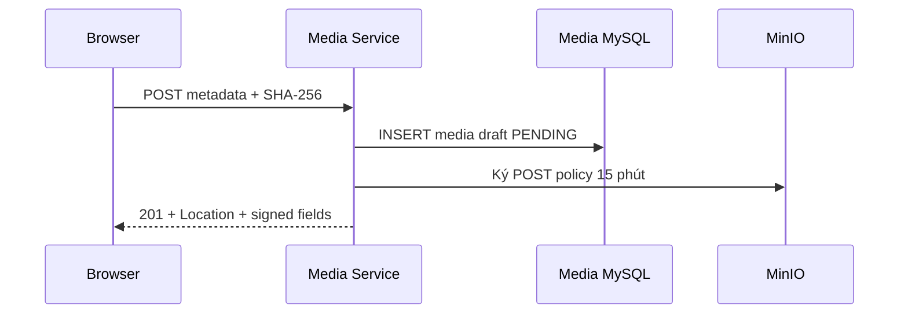

# `POST /media/api/media/upload-intents`

Business flow: [`post-media-direct.md`](../../../business-flows/media/post-media-direct.md).

## Mục đích

Media Service tạo một media draft `PENDING` và một MinIO presigned POST policy để
trình duyệt tải file trực tiếp, không chuyển bytes qua Gateway/API. Public path là
`POST /media/api/media/upload-intents`; direct service path là
`POST /api/media/upload-intents`.

## Kiến trúc



## Xác thực và phân quyền

JWT chưa được triển khai. Theo convention hiện tại, request tạm truyền
`uploadedByType=STUDENT` và `uploadedBy`; Media Service xác minh student tồn tại.
Hai field này chưa phải identity đáng tin cậy. Khi có JWT, actor phải lấy từ
claim và ownership của intent vẫn thuộc actor đã xác thực.

## Yêu cầu

`Content-Type: application/json`

```json
{
  "originalFileName": "avatar.png",
  "mediaType": "IMAGE",
  "contentType": "image/png",
  "sizeBytes": 24576,
  "checksumSha256": "b2c2f3f0524c01c0bb9f65fd20b50c0f3bce923fb3f010e7badd7a50180dbeab",
  "uploadedBy": "11111111-1111-1111-1111-111111111111",
  "uploadedByType": "STUDENT"
}
```

| Field | Quy tắc |
| --- | --- |
| `originalFileName` | 1–255 ký tự, chỉ tên file, không path/control character và phải có extension. |
| `mediaType` | `IMAGE`, `VIDEO`, `DOCUMENT`, `AUDIO`, `OTHER`; MIME phải thuộc loại tương ứng. |
| `contentType` | MIME được hỗ trợ và được chuẩn hóa. |
| `sizeBytes` | Số dương, không vượt giới hạn cấu hình của loại; tối đa hệ thống 500 MiB. |
| `checksumSha256` | Đúng 64 ký tự hex viết thường do frontend tính. |
| `uploadedByType`, `uploadedBy` | Convention actor tạm thời nêu trên. |

## Phản hồi thành công

```http
201 Created
Location: /media/api/media/8c2bf508-60bb-44d4-91aa-1baad98db09c
```

```json
{
  "data": {
    "mediaId": "8c2bf508-60bb-44d4-91aa-1baad98db09c",
    "status": "PENDING",
    "isDraft": true,
    "expiresAtUtc": "2026-08-18T09:15:00Z",
    "uploadUrl": "http://localhost:9000/images",
    "formFields": {
      "key": "staging/example",
      "policy": "[redacted in documentation]",
      "x-amz-signature": "[redacted in documentation]"
    }
  },
  "meta": { "traceId": "01J..." }
}
```

`uploadUrl` và toàn bộ `formFields` là signed material ngắn hạn: không ghi log,
analytics, error detail, screenshot hay commit vào Postman. Policy hết hạn sau
`Storage:Minio:UploadPresignExpirySeconds`, mặc định `900` giây, và khóa chính
xác object key, content type, exact content length và metadata checksum.

## Idempotency, retry và mã trạng thái

Tạo intent cố ý **không idempotent**: mỗi request hợp lệ tạo `mediaId`, staging
object và policy mới. Policy hết hạn hoặc upload thất bại thì tạo intent mới;
không tái sử dụng signed fields cũ. P5-20 sẽ dọn PENDING/orphan sau khi kiểm tra
tham chiếu database.

- `201`: intent draft `PENDING` được tạo.
- `400 INVALID_MEDIA` / `INVALID_ACTOR_TYPE`: metadata, checksum, tên file hoặc actor sai.
- `404 ACTOR_NOT_FOUND`: student không tồn tại.
- `413 PAYLOAD_TOO_LARGE`: `sizeBytes` vượt giới hạn.
- `415 UNSUPPORTED_MEDIA_TYPE`: MIME không khớp `mediaType`.
- `503 STUDENT_SERVICE_UNAVAILABLE`, `STORAGE_UNAVAILABLE` hoặc `SERVICE_UNAVAILABLE`: dependency/Gateway không sẵn sàng.
- `409` không phải response hiện tại của endpoint tạo intent; conflict object được xử lý ở endpoint complete.

## Usage và troubleshooting

Browser append nguyên vẹn mọi signed field vào `FormData`, gồm cả
`Content-Type` bắt buộc để thỏa policy MIME, append file cuối cùng, rồi POST
trực tiếp tới `uploadUrl`. Nếu browser báo CORS, kiểm tra
`MINIO_API_CORS_ALLOW_ORIGIN`, browser-reachable `MINIO_PUBLIC_ENDPOINT`, protocol
`MINIO_PUBLIC_USE_SSL` và chạy lại `minio-init`. `Endpoint=minio:9000` chỉ dành
cho container nội bộ, không dùng làm URL cho browser.
