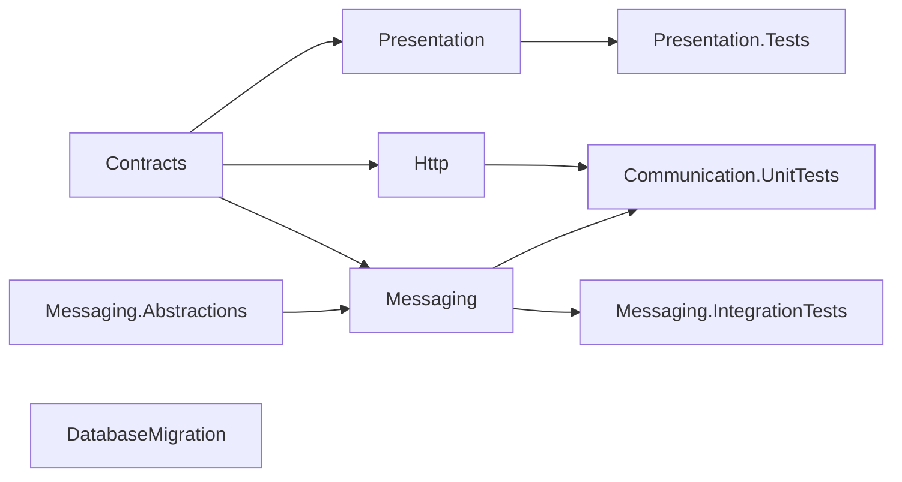

# Kiến trúc BuildingBlocks

## Mục đích

`backend/BuildingBlocks/` tập hợp các thư viện kỹ thuật tái sử dụng giữa Gateway,
API và Worker. Đây không phải service và không sở hữu dữ liệu nghiệp vụ; mỗi
service vẫn tự sở hữu Domain, Application, Infrastructure và database của mình.

## Dependency graph

`Contracts` và `Messaging.Abstractions` chỉ khai báo contract. `Presentation`,
`Http` và `Messaging` là adapter kỹ thuật; `DatabaseMigration` độc lập với các
thư viện còn lại. Ba project test chỉ kiểm tra boundary, không được tham chiếu
từ runtime.

## Tài liệu theo nhóm

- [Contracts](details/contracts.md)
- [Presentation](details/presentation.md)
- [HTTP](details/http.md)
- [Messaging](details/messaging.md)
- [Database migration](details/database-migration.md)
- [Testing](details/testing.md)

## Đã triển khai hiện tại

Các project và project reference trong sơ đồ đã có trong `backend/BuildingBlocks/`.
Chúng được service sử dụng qua extension method hoặc contract công khai; không có
project runtime tổng hợp tên `BuildingBlocks`.

## Định hướng/chưa triển khai

Không có bằng chứng về một package versioning/publishing độc lập, distributed
tracing exporter dùng chung hoặc shared business domain. Nếu bổ sung, phải giữ
dependency hướng vào contract/abstraction và không đưa business rule của service
vào đây.

## Troubleshooting

| Hiện tượng | Kiểm tra | Cách xử lý |
| --- | --- | --- |
| Service không build sau khi thêm shared library | project reference và target framework | Chỉ tham chiếu đúng project cần dùng; toàn bộ hiện dùng `net10.0`. |
| Shared code bắt đầu chứa rule nghiệp vụ | namespace và dependency của service | Chuyển rule về Domain/Application của service sở hữu nó. |
