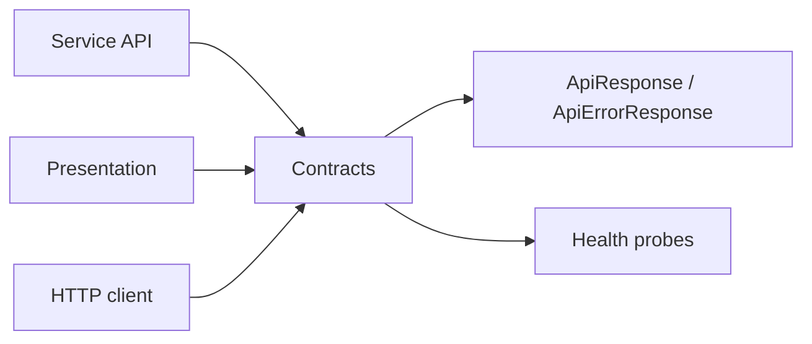

# BuildingBlocks.Contracts

## Mục đích

`BuildingBlocks.Contracts` cung cấp contract HTTP/health nhẹ và constants dùng
chung. Nó giúp các service trả về cùng response envelope, route/header và trạng
thái health nhất quán mà không phụ thuộc vào Presentation hay MassTransit.

## Kiến trúc



Các nhóm chính là `ApiResponse<TData>`, `ApiErrorResponse`, pagination metadata,
`ApiException`, `ApiRoutes`, constants (`ApiHeaderNames`, `ServiceNames`, ...),
`IDatabaseHealthProbe`, `IMessagingHealthProbe` và `StudentQueryResponse`.
Contract mô tả giao tiếp kỹ thuật; không được mang entity hay business rule của
một service.

## Cách dùng

Presentation dùng factory để tạo envelope; service chỉ truyền DTO của mình:

```csharp
return Results.Json(
    ApiResponseFactory.Success(dto, context.TraceIdentifier));
```

Health adapter cài đặt interface trong Infrastructure rồi đăng ký vào DI:

```csharp
services.AddSingleton<IDatabaseHealthProbe, DatabaseHealthProbe>();
```

## Đã triển khai hiện tại

`ApiResponse<TData>` mang `Data` và `ResponseMeta`; lỗi có `Code`, `Message` và
`Details`. `X-Correlation-Id`, route Media/Student/Notification, tên năm service
và health constants đã được khai báo. `ApiException` hiện có biến thể
`ServiceUnavailableException` với HTTP 503.

## Định hướng/chưa triển khai

Chưa có API versioning contract chung hoặc contract package phát hành độc lập.
Không coi route constant là bằng chứng endpoint tương ứng đã được map ở mọi
service; runtime phải được xác nhận tại `Program.cs` và endpoint implementation.

## Troubleshooting

| Hiện tượng | Nguyên nhân thường gặp | Cách xử lý |
| --- | --- | --- |
| Response không có trace ID | Bỏ qua `ApiResponseFactory` hoặc middleware | Dùng factory và đăng ký `UseSharedApiMiddleware()`. |
| Health endpoint lỗi DI | Chưa đăng ký một trong hai health probe | Đăng ký cả `IDatabaseHealthProbe` và `IMessagingHealthProbe`. |
| Thay đổi shared DTO gây lỗi service khác | Breaking change trong public contract | Thêm contract mới hoặc triển khai tương thích ngược trước khi bỏ field cũ. |
