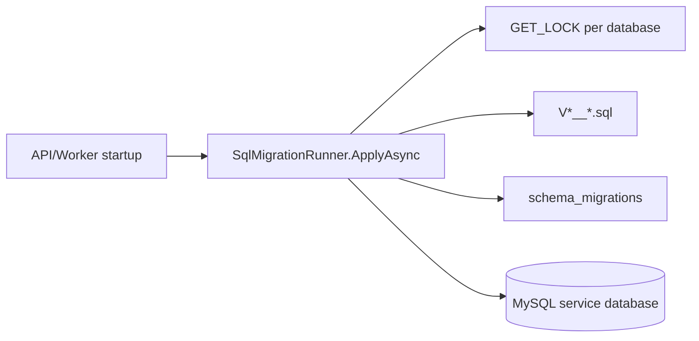

# BuildingBlocks.DatabaseMigration

## Mục đích

`BuildingBlocks.DatabaseMigration` cung cấp `SqlMigrationRunner` cho MySQL.
Mỗi service gọi runner với connection string và thư mục migration của chính nó;
library không biết schema hay database nghiệp vụ của service.

## Kiến trúc



Runner đọc migration theo thứ tự version, lấy advisory lock tên theo database,
tạo `schema_migrations` khi cần và chạy từng file trong transaction cùng bản ghi
history/checksum.

## Cách dùng

```csharp
await SqlMigrationRunner.ApplyAsync(
    new SqlMigrationRunnerOptions(
        ServiceNames.Student,
        connectionString,
        migrationsDirectory),
    logger.LogInformation,
    cancellationToken);
```

Tên file phải theo `V<version>__<name>.sql`, ví dụ `V002__add_profile.sql`.
Không dùng connection string của service khác.

## Đã triển khai hiện tại

Runner validate input và migration directory, chống version trùng, so sánh SHA-256
checksum của migration đã áp dụng, dùng `GET_LOCK` timeout 60 giây và rollback
transaction khi một migration lỗi. `schema_migrations` lưu version, name,
`applied_at` và checksum.

## Định hướng/chưa triển khai

Chưa có rollback migration tự động, dry-run CLI, dependency graph giữa migration
hay orchestration đa database. Khi migration đã chạy, phải tạo version mới thay vì
sửa file cũ.

## Troubleshooting

| Hiện tượng | Nguyên nhân thường gặp | Cách xử lý |
| --- | --- | --- |
| Checksum mismatch | Đã sửa migration đã apply | Khôi phục nội dung cũ hoặc tạo migration version mới. |
| Không lấy được lock | Một instance đang migration hoặc kết nối treo | Kiểm tra deployment/connection và chờ/sửa contention trước khi chạy lại. |
| File bị bỏ qua | Sai tên file hoặc nằm không đúng thư mục | Dùng mẫu `V<number>__<lowercase-name>.sql` tại root migrations directory. |
