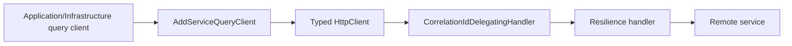

# BuildingBlocks.Http

## Mục đích

`BuildingBlocks.Http` chuẩn hóa synchronous query giữa service qua typed
`HttpClient`. Nó truyền correlation ID, validate endpoint configuration và áp dụng
resilience policy tập trung, thay vì để mỗi query client tự cấu hình khác nhau.

## Kiến trúc



Project phụ thuộc `Contracts` để dùng `X-Correlation-Id`. Query client cụ thể vẫn
thuộc Infrastructure của service gọi; BuildingBlocks không biết DTO hay business
rule của query đó.

## Cách dùng

```csharp
builder.Services.AddServiceQueryClient<IStudentQueryClient, StudentQueryClient>(
    builder.Configuration,
    "StudentService");
```

`ServiceEndpoints:<key>` phải là HTTP/HTTPS absolute URL hợp lệ. Extension đăng
ký `IHttpContextAccessor`, handler correlation và typed client; service dùng
interface riêng của mình để gọi remote API.

## Đã triển khai hiện tại

`CorrelationIdDelegatingHandler` lấy trace ID từ request hiện tại và thêm vào
outgoing request nếu header chưa có. `AddServiceQueryClient` validate endpoint,
đặt base address, timeout, và dùng `AddStandardResilienceHandler` với retry có
jitter cho transient failure.

## Định hướng/chưa triển khai

Chưa có circuit breaker policy cấu hình riêng theo service, service discovery hay
automatic fallback/cache. Đây là cơ chế query có response; command/event không
đi qua `HttpClient` này.

## Troubleshooting

| Hiện tượng | Nguyên nhân thường gặp | Cách xử lý |
| --- | --- | --- |
| Startup ném lỗi endpoint | `ServiceEndpoints:<key>` thiếu hoặc không phải URL absolute | Sửa configuration thành `http://` hoặc `https://` hợp lệ. |
| Trace khó nối giữa hai service | Không đi qua typed client/handler | Đăng ký client bằng `AddServiceQueryClient` và giữ correlation header. |
| Retry không giải quyết lỗi | Lỗi không transient hoặc downstream sai URL | Kiểm tra status/network và sửa dependency; không tăng retry mù quáng. |
