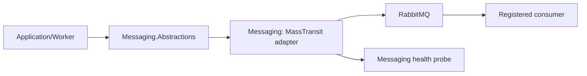

# BuildingBlocks.Messaging

## Mục đích

Nhóm Messaging tách contract transport-neutral khỏi MassTransit/RabbitMQ adapter.
`BuildingBlocks.Messaging.Abstractions` định nghĩa `ICommand`, `IIntegrationEvent`,
`ICommandSender`, `IEventPublisher`, `ICorrelationContextAccessor`; project
`BuildingBlocks.Messaging` hiện thực các interface đó và đăng ký consumer/health.

## Kiến trúc



Command được gửi tới một endpoint owner; integration event được publish để nhiều
consumer có thể nhận. Correlation ID và source-service header được transport
adapter đặt khi message được gửi/publish.

## Cách dùng

Đăng ký messaging và consumer tại composition root:

```csharp
builder.Services.AddLmsMessagingWithConsumers(
    builder.Configuration,
    ServiceNames.Notification,
    consumers => consumers.AddCommandConsumer<DispatchConsumer, DispatchCommand>());
```

Application nhận `ICommandSender` hoặc `IEventPublisher`, không nhận
`IBus`/MassTransit type trực tiếp. Consumer dùng `IConsumer<TMessage>` trong
Worker hoặc composition root phù hợp.

## Đã triển khai hiện tại

Adapter dùng MassTransit RabbitMQ, options cho connection/retry/consumer/host,
endpoint formatter, registration extension cho command/event consumer,
`MassTransitCommandSender`, `MassTransitEventPublisher` và
`MassTransitMessagingHealthProbe`. Có unit test cho config/correlation/resilience
và integration test RabbitMQ bằng Testcontainers cho command, event, retry và
correlation.

## Quan sát Worker

`AddLmsMessagingWithConsumers` tự đăng ký `WorkerConsumeLoggingObserver` cho mọi
consumer của Worker. Mỗi lần một message được Worker xử lý có ba log lifecycle:

- `WorkerEvent=Received`: MassTransit đã nhận message và sắp dispatch vào consumer.
- `WorkerEvent=Completed`: toàn bộ consumer của message đã kết thúc thành công.
- `WorkerEvent=Failed`: consumer ném exception; log giữ exception để điều tra và
  cho biết attempt/retry state tại thời điểm lỗi.

Log luôn có `MessageType`, `Queue`, `MessageId`, `CorrelationId`,
`ConversationId`, `SourceService`, `RetryAttempt`, `RetryLimit` và
`RedeliveryCount`. `RetryAttempt=0` là lần xử lý đầu tiên; `RetryLimit` là
`Messaging:Retry:RetryCount` đang cấu hình. Chỉ metadata an toàn được ghi, không
ghi message payload, URL ký, chữ ký MinIO, access key hoặc token.

`AddLmsMessaging` không gắn observer này vì host đó không đăng ký consumer. Ví dụ
Scheduler Worker hiện chỉ host messaging mà chưa có job/consumer runtime, nên sẽ
chỉ có log lifecycle khi sau này nó đăng ký consumer qua
`AddLmsMessagingWithConsumers`.

## Định hướng/chưa triển khai

Không có inbox/outbox dùng chung trong BuildingBlocks, message schema registry,
dead-letter operational runbook hay distributed tracing exporter được chứng minh
trong source này. At-least-once delivery vẫn yêu cầu idempotency do service sở hữu
consumer thực hiện.

## Troubleshooting

| Hiện tượng | Kiểm tra | Cách xử lý |
| --- | --- | --- |
| Consumer không nhận message | service name, endpoint formatter, registration | Đăng ký đúng `AddCommandConsumer`/`AddEventConsumer` tại Worker/API host. |
| Correlation bị mất | sender/publisher bypass adapter | Inject `ICommandSender`/`IEventPublisher`, không publish trực tiếp tùy tiện. |
| Health không healthy | RabbitMQ options và kết nối broker | Kiểm tra `Messaging:RabbitMq` và service host trước khi thay retry. |
| Consumer lỗi hoặc retry | Lọc `WorkerEvent=Failed` theo `MessageId`/`CorrelationId`; đối chiếu `RetryAttempt` và exception | Sửa nguyên nhân ở consumer/dependency; không tự thêm retry riêng vào consumer. |
