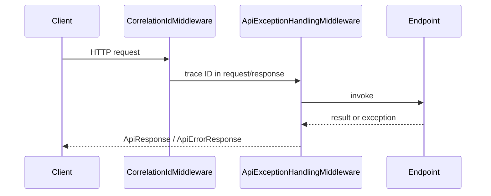

# BuildingBlocks.Presentation

## Mục đích

`BuildingBlocks.Presentation` chuẩn hóa HTTP boundary cho ASP.NET Core: correlation
ID, exception response, CORS, service info/health và Gateway Swagger aggregation.
Nó phụ thuộc `Contracts`, không phụ thuộc Application hay Infrastructure của
bất kỳ service nào.

## Kiến trúc



`UseSharedApiMiddleware()` luôn đăng ký `CorrelationIdMiddleware` trước
`ApiExceptionHandlingMiddleware`. Endpoint extensions map `GET /`, `GET /health`
và Gateway Swagger document; CORS đọc `Cors:AllowedOrigins` rồi expose correlation
header.

## Cách dùng

```csharp
builder.Services.AddLmsCors(builder.Configuration);
var app = builder.Build();
app.UseSharedApiMiddleware();
app.UseLmsCors();
app.MapServiceInfoEndpoint(ServiceNames.Student);
app.MapDatabaseHealthEndpoint(ServiceNames.Student);
```

Gateway map document của service bằng:

```csharp
app.MapGatewaySwaggerDocument("/student", ServiceNames.Student);
```

## Đã triển khai hiện tại

Middleware sinh hoặc chuyển tiếp `X-Correlation-Id`, đặt `TraceIdentifier` và
chuẩn hóa lỗi validation, payload quá lớn, `ApiException` và unhandled exception.
`MapDatabaseHealthEndpoint` kiểm tra đồng thời database và messaging probe;
trả 503 khi một dependency không healthy. Gateway Swagger tải OpenAPI document
qua named `HttpClient` và thay `servers` bằng gateway prefix.

## Định hướng/chưa triển khai

Chưa có authn/authz middleware, rate limiting, standardized problem-details hay
API versioning trong project này. Không tự thêm middleware ở đây nếu nó mang
policy riêng của một service.

## Troubleshooting

| Hiện tượng | Kiểm tra | Cách xử lý |
| --- | --- | --- |
| Browser bị CORS | `Cors:AllowedOrigins` và thứ tự `UseLmsCors()` | Khai báo origin frontend đầy đủ, không để danh sách rỗng. |
| `/health` trả 503 | health probes trả `IsHealthy = false` | Kiểm tra DB/RabbitMQ adapter và đăng ký DI của service. |
| Gateway Swagger trả 503 | named client hoặc document downstream | Kiểm tra base URL của named client và `/swagger/v1/swagger.json` downstream. |
