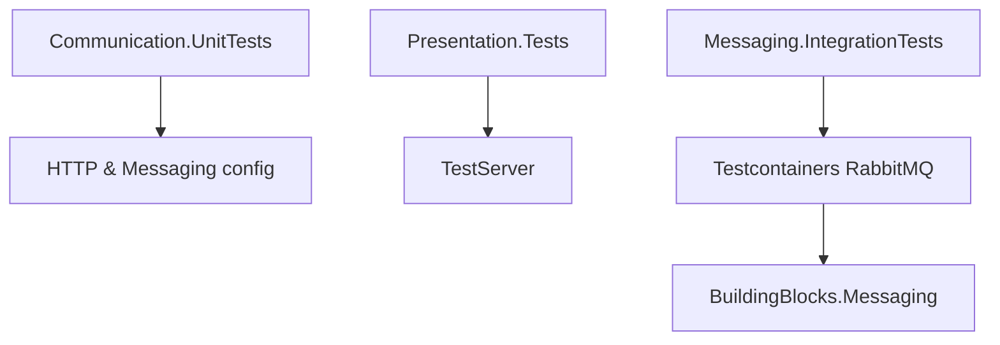

# Kiểm thử BuildingBlocks

## Mục đích

Ba test project kiểm tra shared technical boundary trước khi service sử dụng:
`BuildingBlocks.Communication.UnitTests`, `BuildingBlocks.Presentation.Tests` và
`BuildingBlocks.Messaging.IntegrationTests`. Chúng không phải runtime dependency.

## Kiến trúc



Unit test tập trung vào configuration/correlation/resilience. Presentation test
dùng `Microsoft.AspNetCore.TestHost` kiểm tra middleware, CORS, health và Gateway
Swagger. Messaging integration test khởi chạy RabbitMQ container thật để kiểm tra
topology, retry, command/event và correlation.

## Cách dùng

Chạy từng boundary từ repository root:

```bash
dotnet test backend/BuildingBlocks/BuildingBlocks.Communication.UnitTests
dotnet test backend/BuildingBlocks/BuildingBlocks.Presentation.Tests
dotnet test backend/BuildingBlocks/BuildingBlocks.Messaging.IntegrationTests
```

Integration test cần Docker daemon chạy và environment có thể pull/run RabbitMQ
container; unit và TestServer test không cần RabbitMQ thật.

## Đã triển khai hiện tại

Communication tests kiểm tra registration retry và correlation handler. Presentation
tests dùng TestServer cho API middleware, database health endpoint, gateway CORS và
Swagger document. Messaging integration test dùng `Testcontainers.RabbitMq` và
kiểm tra command/event consumers, retry và correlation header.

## Định hướng/chưa triển khai

Chưa thấy contract test xuyên service, load/performance test, coverage gate hay
test cho migration runner trong các project này. Các capability đó phải được thêm
theo test layer phù hợp, không biến test project thành runtime shared library.

## Troubleshooting

| Hiện tượng | Kiểm tra | Cách xử lý |
| --- | --- | --- |
| Messaging integration test không khởi động | Docker daemon, quyền socket, image pull | Khởi động Docker và bảo đảm môi trường truy cập image RabbitMQ. |
| TestServer test fail vì DI | stub health probe/CORS config | Đăng ký dependency test đúng như test fixture hiện có. |
| Test flaky do retry | assertion timeout và RabbitMQ readiness | Giữ test async, chờ condition đã định nghĩa; không thay assertion bằng sleep cố định. |
