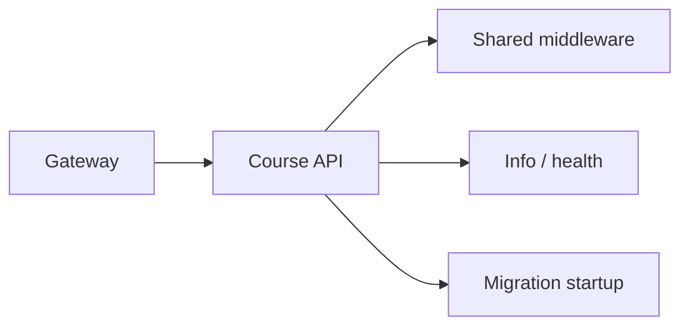

# Course Service — API

## Mục đích

`CourseService.Api` là composition root HTTP, không chứa Course business rule.

## Kiến trúc

## Cách dùng

Host đăng ký DependencyInjection, shared middleware, service info và health;
endpoint nghiệp vụ khi có phải chỉ map request sang Application.

## Đã triển khai hiện tại

`Program.cs` chạy migration và map service info/database health. Không có Course
CRUD endpoint hiện diện ở runtime source.

## Định hướng/chưa triển khai

API docs không thay thế bằng chứng mapping endpoint; bổ sung endpoint phải cập
nhật API docs, component test và Application handler cùng lúc.

## Troubleshooting

| Hiện tượng | Cách xử lý |
| --- | --- |
| Gateway gọi 404 | Kiểm tra endpoint đã map thật trong `Program.cs`. |
