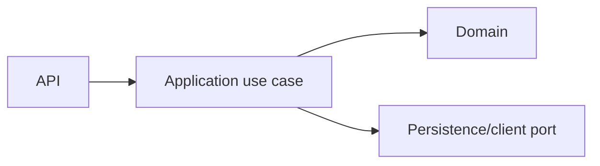

# Course Service — Application

## Mục đích

`CourseService.Application` là nơi đặt use case, validation và port mà API/Worker
gọi vào; nó chỉ được phép phụ thuộc Domain.

## Kiến trúc

## Cách dùng

API nhận request, map thành command/query rồi inject handler/service Application.
Implementation của port được đăng ký tại Infrastructure composition root.

## Đã triển khai hiện tại

Project Application và project reference theo Clean Architecture đã tồn tại;
không có endpoint Course nghiệp vụ được map trong `CourseService.Api/Program.cs`.

## Định hướng/chưa triển khai

CRUD Course/Lesson, enrollment và progress chỉ được ghi là runtime khi handler
và endpoint tương ứng cùng hiện diện.

## Troubleshooting

| Hiện tượng | Cách xử lý |
| --- | --- |
| Handler cần DbContext | Đặt interface/repository port ở Application, không tham chiếu EF Core. |
