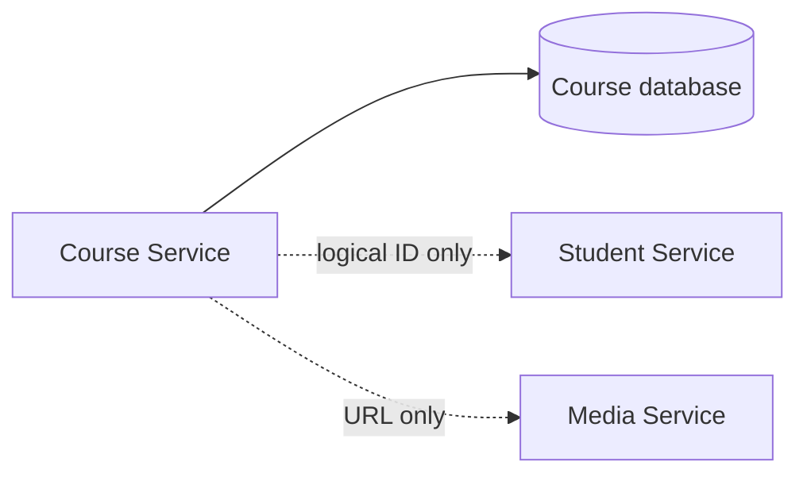

# Course Service — Database và integration

## Mục đích

Course database là nguồn dữ liệu duy nhất cho Course, Lesson, Enrollment và
LessonProgress; ID Student/media URL chỉ là logical reference.

## Kiến trúc

## Cách dùng

Chạy migration của Course riêng; integration cần contract HTTP/message, không
được query database service khác.

## Đã triển khai hiện tại

Migration/schema và `CourseDbContext` tồn tại. Không có evidence cho remote
integration runtime của Course trong source hiện tại.

## Định hướng/chưa triển khai

Thêm Student/Media integration qua typed client hoặc messaging sau khi contract
và idempotency được xác định.

## Troubleshooting

| Hiện tượng | Cách xử lý |
| --- | --- |
| Cần dữ liệu Student | Gọi service qua contract; không join DB. |
