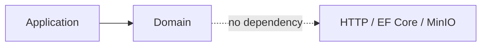

# Course Service — Domain

## Mục đích

`CourseService.Domain` là boundary cho mô hình Course, Lesson, Enrollment và
LessonProgress. Project tồn tại để giữ business rule độc lập HTTP, EF Core và
service khác.

## Kiến trúc

## Cách dùng

Application chỉ dùng type/rule Domain; persistence model scaffolded không được
đặt vào Domain. Entry point là use case trong `CourseService.Application`.

## Đã triển khai hiện tại

Project Domain đã tách độc lập. Entity hiện được scaffold và lưu trong
Infrastructure/Persistence, vì vậy không khẳng định aggregate/rule Course đã
được hiện thực đầy đủ trong Domain source.

## Định hướng/chưa triển khai

Chuyển entity/rule nghiệp vụ từ persistence sang Domain chỉ khi use case cần;
không đưa EF Core attribute hoặc remote client vào project này.

## Troubleshooting

| Hiện tượng | Cách xử lý |
| --- | --- |
| Domain cần gọi database | Khai báo port ở Application, hiện thực tại Infrastructure. |
