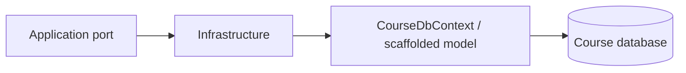

# Course Service — Infrastructure

## Mục đích

`CourseService.Infrastructure` hiện thực persistence, migration startup support và
database health probe cho Course database.

## Kiến trúc

## Cách dùng

API đăng ký Infrastructure tại composition root; chỉ adapter này được phép dùng
EF Core/MySQL và migration runner.

## Đã triển khai hiện tại

Có `CourseDbContext`, scaffolded Course/Lesson/Enrollment/LessonProgress và
`CourseDatabaseHealthProbe`.

## Định hướng/chưa triển khai

Không có MinIO adapter hay direct Student database client được chứng minh.

## Troubleshooting

| Hiện tượng | Cách xử lý |
| --- | --- |
| Health fail | Kiểm tra Course connection string và database migration. |
