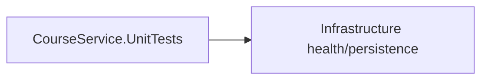

# Course Service — Testing

## Mục đích

`CourseService.UnitTests` là safety net hiện có cho logic/adapter Course.

## Kiến trúc



## Cách dùng

```bash
dotnet test backend/Services/Course/CourseService.UnitTests
```

## Đã triển khai hiện tại

Test project có test `CourseDatabaseHealthProbe`; chưa thấy component hoặc
integration test project riêng cho Course.

## Định hướng/chưa triển khai

Khi map endpoint Course, thêm component test; khi phụ thuộc DB/broker thật, thêm
integration test thay vì biến unit test thành end-to-end test.

## Troubleshooting

| Hiện tượng | Cách xử lý |
| --- | --- |
| Test không thấy Infrastructure | Kiểm tra project reference của test project. |
