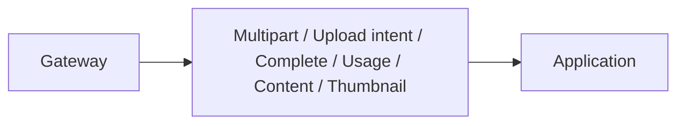

# Media Service — API

## Mục đích

API là multipart/direct-upload/content HTTP boundary cho Media Service qua Gateway.

## Kiến trúc

## Cách dùng

Endpoint parse request, map response DTO và gọi handler; không trả bucket/object key.

## Đã triển khai hiện tại

Có multipart upload, upload-intent, idempotent upload-complete, usage,
URL/content, thumbnail status/retry endpoint và Media health. Signed fields chỉ
được trả cho intent caller và phải được redacted khỏi log.

## Định hướng/chưa triển khai

Policy auth/authorization chỉ được coi là chạy khi endpoint source chứng minh.

## Troubleshooting

| Hiện tượng | Cách xử lý |
| --- | --- |
| Upload 413 | Kiểm tra payload limit và `ApiException` mapping. |
| Direct upload CORS | Kiểm tra public MinIO endpoint và allowed frontend origin. |
