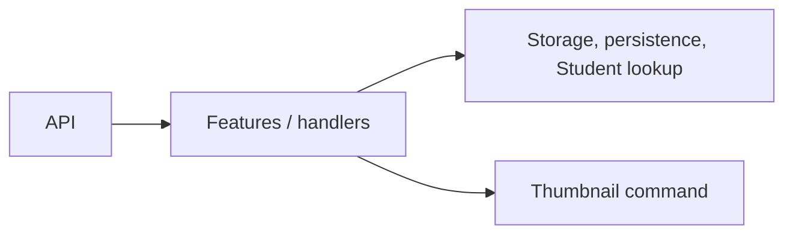

# Media Service — Application

## Mục đích

Application điều phối upload, content, usage URL, thumbnail và actor validation qua
storage/persistence/client abstractions.

## Kiến trúc

## Cách dùng

API/Worker inject handler; `IStorage`, persistence interfaces, `IStudentLookup` và
`IMediaUrlProvider` được Infrastructure hiện thực.

## Đã triển khai hiện tại

Có `Features`, actor validation, storage/persistence/url abstractions và
`GenerateMediaThumbnailV1` contract.

## Định hướng/chưa triển khai

Không coi stale-object cleanup là Application job đang chạy.

## Troubleshooting

| Hiện tượng | Cách xử lý |
| --- | --- |
| Handler gọi MinIO trực tiếp | Inject `IStorage`, không tham chiếu SDK. |
