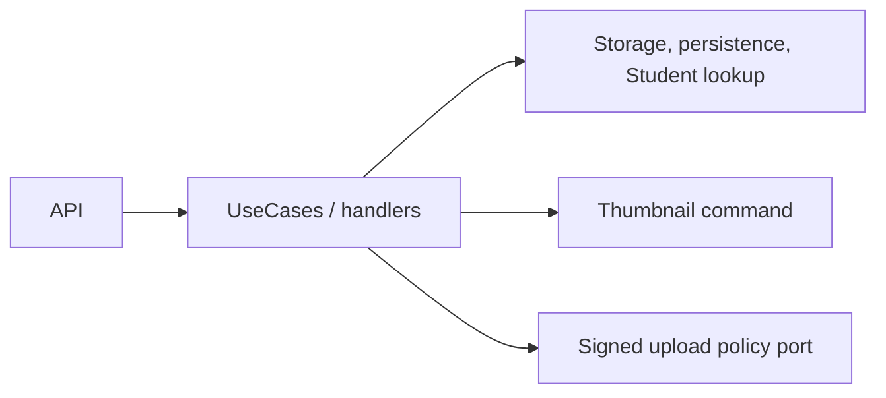

# Media Service — Application

## Mục đích

Application điều phối multipart/direct upload, completion, content, usage URL, thumbnail và actor validation qua
storage/persistence/client abstractions.

## Kiến trúc

## Cách dùng

API/Worker inject handler; `IMediaRepository` chỉ sở hữu media object,
`IMediaUsageRepository` sở hữu liên kết usage, còn `IStorage`, `IStudentLookup`
và `IMediaUrlProvider` là các port khác được Infrastructure hiện thực.

## Đã triển khai hiện tại

Có domain entities `Media` và `MediaUsage`, `CreateUploadIntent`,
`CompleteDirectUpload`, actor validation, storage/persistence/url abstractions và
`GenerateMediaThumbnailV1` contract.

## Định hướng/chưa triển khai

Không coi usage-driven draft transition hoặc stale/orphan cleanup là Application
job đang chạy; lần lượt thuộc P5-13 và P5-20.

## Troubleshooting

| Hiện tượng | Cách xử lý |
| --- | --- |
| Handler gọi MinIO trực tiếp | Inject `IStorage`, không tham chiếu SDK. |
