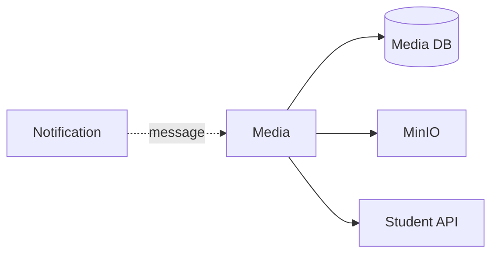

# Media Service — Database và integration

## Mục đích

Media database sở hữu object metadata/usage/derivation; MinIO chỉ Media Service truy cập.

## Kiến trúc

## Cách dùng

Gọi Student qua typed query client; dùng message contract cho notification usage.

## Đã triển khai hiện tại

EF Outbox, Student client, MinIO adapter và Media contracts tồn tại.

## Định hướng/chưa triển khai

Không cho service khác query media database/bucket trực tiếp.

## Troubleshooting

| Hiện tượng | Cách xử lý |
| --- | --- |
| Cần URL media | Dùng Media API contract, không lộ object key. |
