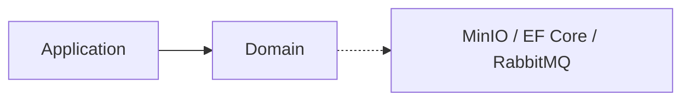

# Media Service — Domain

## Mục đích

Domain giữ boundary Media, Usage và actor policy; không biết MinIO, HTTP hay EF Core.

## Kiến trúc

## Cách dùng

Application dùng Domain để quyết định usage/actor; storage object chỉ đi qua port.

## Đã triển khai hiện tại

Có các source folder `Media`, `Usages`, `Actors` trong `MediaService.Domain`.

## Định hướng/chưa triển khai

Không đặt MinIO object key hoặc Student HTTP response vào Domain.

## Troubleshooting

| Hiện tượng | Cách xử lý |
| --- | --- |
| Rule cần storage | Khai báo abstraction tại Application. |
