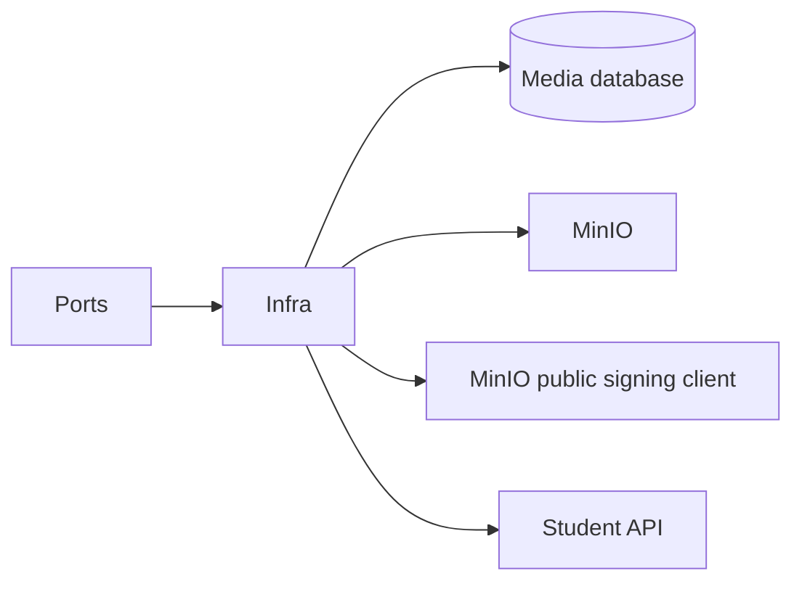

# Media Service — Infrastructure

## Mục đích

Infrastructure hiện thực EF Core, MinIO storage, derivation, Student typed client,
health probe và Outbox persistence.

## Kiến trúc

## Cách dùng

Đăng ký Infrastructure từ API/Worker composition root; chỉ layer này biết SDK và
connection settings.

## Đã triển khai hiện tại

Có `Storage`, `Services`, `Clients`, `Persistence`, `Database`, `Health` folders.
`Persistence/Context` giữ `MediaDbContext`, `Persistence/Transactions` giữ
finalizer atomic, và `Persistence/Repositories` tách `EfMediaRepository` và
`EfMediaUsageRepository`; `Persistence/Mappers` là ranh giới chuyển
`Scaffolded` EF model sang domain entity, nên Application không phụ thuộc EF model.
`MinioUploadPolicyProvider` ký exact POST policy qua browser-reachable endpoint;
`MinioStorageService` dùng internal endpoint để HEAD, ETag-conditioned copy sang
unique final key và best-effort cleanup. Hai endpoint không được tráo nhau.

## Định hướng/chưa triển khai

Không service nào khác dùng MinIO adapter này trực tiếp.

## Troubleshooting

| Hiện tượng | Cách xử lý |
| --- | --- |
| Storage unhealthy | Kiểm tra MinIO endpoint/credential và health adapter. |
| Browser không mở được `uploadUrl` | Kiểm tra `PublicEndpoint`, `PublicUseSsl` và MinIO CORS origin. |
