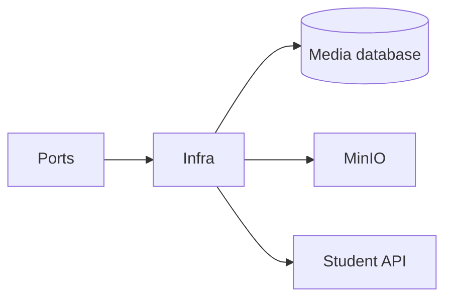

# Media Service — Infrastructure

## Mục đích

Infrastructure hiện thực EF Core, MinIO storage, derivation, Student typed client,
health probe và Outbox persistence.

## Kiến trúc

## Cách dùng

Đăng ký Infrastructure từ API/Worker composition root; chỉ layer này biết SDK và
connection settings.

## Đã triển khai hiện tại

Có `Storage`, `Derivation`, `Clients`, `Persistence`, `Database`, `Health` folders.

## Định hướng/chưa triển khai

Không service nào khác dùng MinIO adapter này trực tiếp.

## Troubleshooting

| Hiện tượng | Cách xử lý |
| --- | --- |
| Storage unhealthy | Kiểm tra MinIO endpoint/credential và health adapter. |
