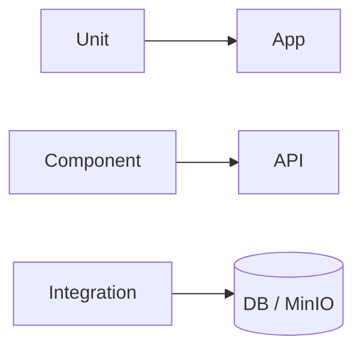

# Media Service — Testing

## Mục đích

Media có unit, component và integration tests cho Application, endpoint, MinIO và flow.

## Kiến trúc



## Cách dùng

```bash
dotnet test backend/Services/Media/MediaService.UnitTests
dotnet test backend/Services/Media/MediaService.ComponentTests
dotnet test backend/Services/Media/MediaService.IntegrationTests
```

## Đã triển khai hiện tại

Các test project và `MediaUploadUsageFlowTests`/`MinioStorageServiceTests` tồn tại.

## Định hướng/chưa triển khai

Không có full E2E Gateway/frontend test tại đây.

## Troubleshooting

| Hiện tượng | Cách xử lý |
| --- | --- |
| Storage test fail | Kiểm tra container/MinIO fixture và credential. |
