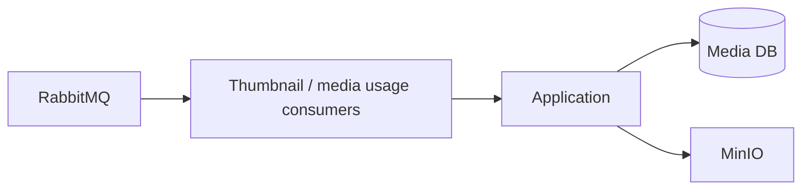

# Media Service — Worker

## Mục đích

Worker nhận message nền cho thumbnail và notification-media usage.

## Kiến trúc

## Cách dùng

Worker đăng ký consumer qua shared Messaging và dùng cùng Application/Infrastructure.

## Đã triển khai hiện tại

Có generate-thumbnail consumer, fault consumer và notification media usage consumer.
Mọi command/fault message vào các consumer này đều có log `Received`, `Completed`
hoặc `Failed` từ shared `WorkerConsumeLoggingObserver`; dùng `MessageId` hoặc
`CorrelationId` để ghép log Media Worker với Notification/Course caller. Log không
ghi payload, presigned URL hoặc credential MinIO.

## Định hướng/chưa triển khai

Không có Scheduler-driven stale-PENDING cleanup runtime.

## Troubleshooting

| Hiện tượng | Cách xử lý |
| --- | --- |
| Consumer không chạy | Kiểm tra RabbitMQ config và consumer registration. |
| Thumbnail/usage retry hoặc lỗi | Lọc `WorkerEvent=Failed`, `MessageType`, `MessageId`; kiểm tra exception và `RetryAttempt/RetryLimit` trước khi xem `*_error` queue. |
