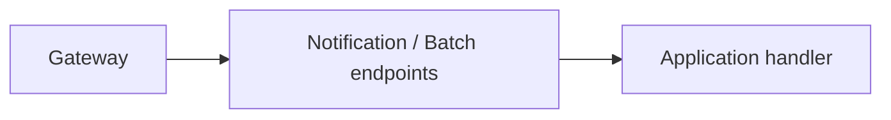

# Notification Service — API

## Mục đích

API cung cấp HTTP boundary cho notification và batch.

## Kiến trúc

## Cách dùng

Request/response DTO nằm `Api/Contracts`; `NotificationResponseMapper` đổi Application
summary sang HTTP response. Mỗi route có đúng một file trong
`Api/Endpoints/<Resource>/<UseCase>/` và chỉ gọi handler tương ứng.

## Đã triển khai hiện tại

Có endpoint riêng cho create/get Notification và create/list/get/failed-items/retry-failed
Notification Batch. `Program.cs` map từng endpoint extension, service info/health và Outbox setup.

## Định hướng/chưa triển khai

Không coi API call là delivery hoàn tất; Worker xử lý command bất đồng bộ.

## Troubleshooting

| Hiện tượng | Cách xử lý |
| --- | --- |
| Batch response sai | Kiểm tra mapper/handler, không sửa persistence từ endpoint. |
