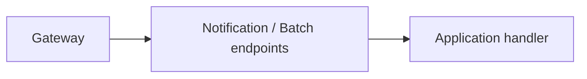

# Notification Service — API

## Mục đích

API cung cấp HTTP boundary cho notification và batch.

## Kiến trúc

## Cách dùng

Request/response DTO nằm `Api/Contracts`; endpoint map sang command/query handler.

## Đã triển khai hiện tại

Có `NotificationEndpoints` và `NotificationBatchEndpoints`, service info/health và
Outbox setup trong host.

## Định hướng/chưa triển khai

Không coi API call là delivery hoàn tất; Worker xử lý command bất đồng bộ.

## Troubleshooting

| Hiện tượng | Cách xử lý |
| --- | --- |
| Batch response sai | Kiểm tra mapper/handler, không sửa persistence từ endpoint. |
