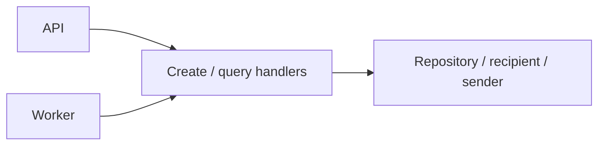

# Notification Service — Application

## Mục đích

Application xử lý notification đơn, batch create/query, snapshot/dispatch qua ports.

## Kiến trúc

## Cách dùng

API và Worker inject handler theo use case. Repository models nằm riêng trong
`Application/Repositories/Models`; `INotificationBatchRepository` phục vụ create,
snapshot và query, còn `INotificationBatchDispatchRepository` chỉ phục vụ claim,
complete và finalize. `IStudentRecipientClient` và `INotificationSender` được
Infrastructure hiện thực.

## Đã triển khai hiện tại

Có `UseCases/Notifications/{Create,GetById}` và
`UseCases/NotificationBatches/{Create,GetById,GetFailedItems,Snapshot,Dispatch}`,
media reference extractor và command `SnapshotNotificationBatchV1` /
`DispatchNotificationBatchV1`.

## Định hướng/chưa triển khai

Không suy diễn delivery provider thật từ interface.

## Troubleshooting

| Hiện tượng | Cách xử lý |
| --- | --- |
| Handler gọi client cụ thể | Phụ thuộc interface Application, không adapter. |
