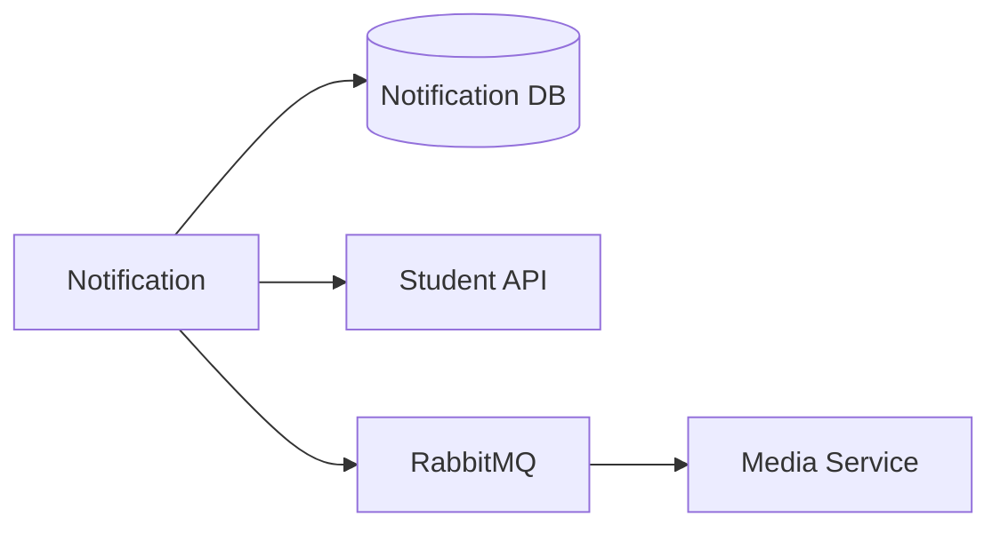

# Notification Service — Database và integration

## Mục đích

Notification DB sở hữu notification/batch/item; Student recipient qua HTTP và Media
usage qua messaging boundary.

## Kiến trúc

## Cách dùng

Giữ recipient/media ID là logical reference; không query DB của Student/Media.

## Đã triển khai hiện tại

Có Student client, MassTransit persistence/Outbox và media reference processing.

## Định hướng/chưa triển khai

Không có cross-service transaction; design xử lý retry/idempotency theo service.

## Troubleshooting

| Hiện tượng | Cách xử lý |
| --- | --- |
| Media reference lỗi | Kiểm tra message contract và Media consumer, không join DB. |
