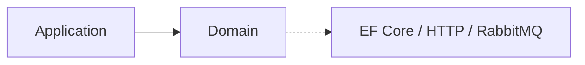

# Notification Service — Domain

## Mục đích

Domain giữ notification, batch, item status và target scope độc lập transport.

## Kiến trúc

## Cách dùng

Application gọi `NotificationBatchState` và `NotificationBatchItemState` thông qua
persistence mapper. Recipient/content adapter và EF entity nằm ngoài Domain.

## Đã triển khai hiện tại

`NotificationTypes` khai báo source/status/batch/item/target scope constants.
`NotificationBatchState` sở hữu snapshot, processing, counter và terminal transition;
`NotificationBatchItemState` sở hữu success/retry/failed với tối đa hai lần thử.

## Định hướng/chưa triển khai

Không mang Student/Media model hoặc delivery provider SDK vào Domain.

## Troubleshooting

| Hiện tượng | Cách xử lý |
| --- | --- |
| Status bị sai layer | Đặt transition rule Domain/Application, không ở endpoint. |
