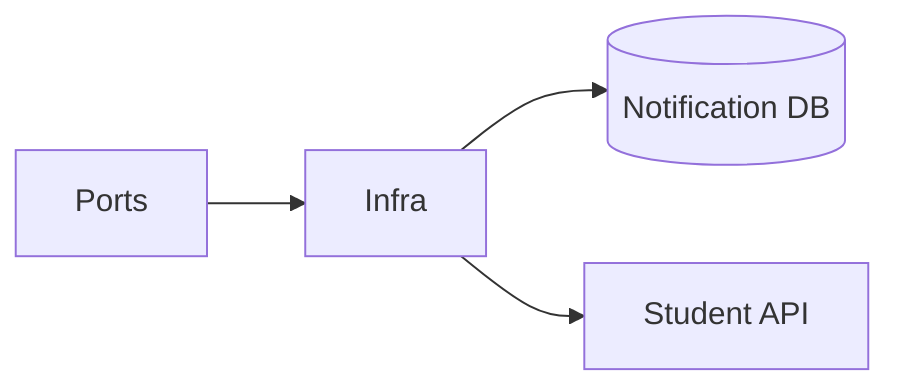

# Notification Service — Infrastructure

## Mục đích

Infrastructure hiện thực EF repositories, Student client, sender, health probe và Outbox.

## Kiến trúc

## Cách dùng

API/Worker đăng ký Infrastructure tại host; chỉ layer này biết EF Core/HttpClient.

## Đã triển khai hiện tại

Có `EfNotificationRepository`, `EfNotificationBatchRepository`, ba persistence mapper,
`StudentRecipientClient`, `SuccessfulNotificationSender`, `FakeNotificationSender`, DbContext Outbox và health probe.
EF scaffolded entity không đi ra ngoài Infrastructure.

## Định hướng/chưa triển khai

`SuccessfulNotificationSender` là binding mặc định của `INotificationSender`: không gọi
provider bên ngoài và coi delivery nội bộ là thành công sau khi inbox được ghi. Khi tích
hợp email hoặc SMS, thay binding DI bằng adapter provider tương ứng mà không đổi Dispatch
handler. `FakeNotificationSender` được giữ lại chỉ cho test hoặc tình huống cần mô phỏng lỗi;
không được inject mặc định.

## Troubleshooting

| Hiện tượng | Cách xử lý |
| --- | --- |
| Recipient query fail | Kiểm tra typed client endpoint và Student service health. |
