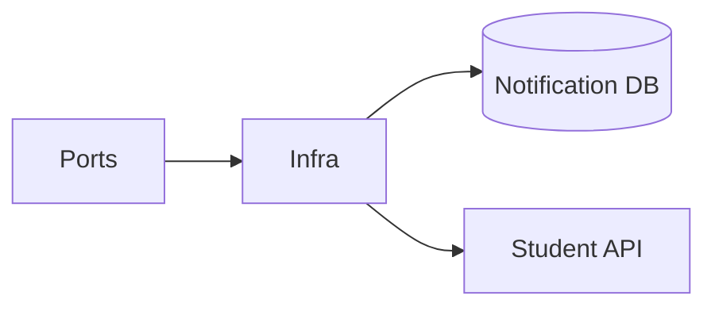

# Notification Service — Infrastructure

## Mục đích

Infrastructure hiện thực EF repositories, Student client, sender, health probe và Outbox.

## Kiến trúc

## Cách dùng

API/Worker đăng ký Infrastructure tại host; chỉ layer này biết EF Core/HttpClient.

## Đã triển khai hiện tại

Có `EfNotificationRepository`, `EfNotificationBatchRepository`, `StudentRecipientClient`,
`FakeNotificationSender`, DbContext Outbox và health probe.

## Định hướng/chưa triển khai

`FakeNotificationSender` không là evidence email/push provider production.

## Troubleshooting

| Hiện tượng | Cách xử lý |
| --- | --- |
| Recipient query fail | Kiểm tra typed client endpoint và Student service health. |
