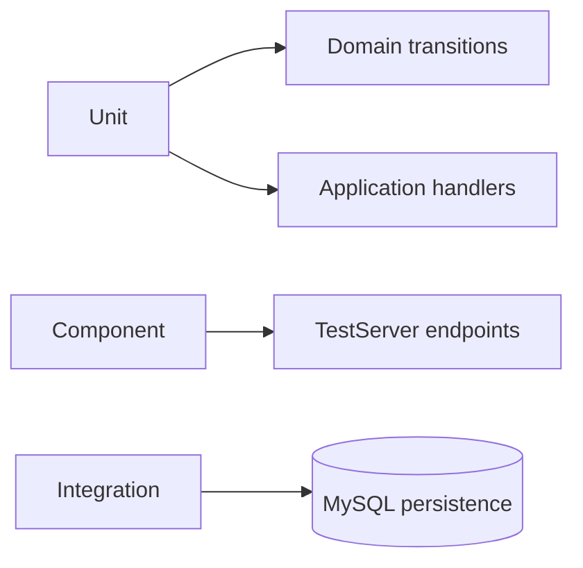

# Notification Service — Testing

## Mục đích

Notification có unit và integration test cho handler, endpoint, lease và persistence.

## Kiến trúc



## Cách dùng

```bash
dotnet test backend/Services/Notification/NotificationService.UnitTests
dotnet test backend/Services/Notification/NotificationService.ComponentTests
dotnet test backend/Services/Notification/NotificationService.IntegrationTests
```

## Đã triển khai hiện tại

Có architecture/header, Domain transition, handler/media-reference unit test; endpoint
TestServer nằm trong ComponentTests riêng; lease/concurrency nằm trong IntegrationTests.
Danh mục chi tiết: [unit](../../../../tests/notification-service/unit.md),
[component](../../../../tests/notification-service/component.md) và
[integration](../../../../tests/notification-service/integration.md).

## Định hướng/chưa triển khai

Chưa có E2E delivery provider thật; `FakeNotificationSender` chỉ phục vụ local/test.

## Troubleshooting

| Hiện tượng | Cách xử lý |
| --- | --- |
| Lease test fail | Kiểm tra database fixture và concurrency assumptions. |
