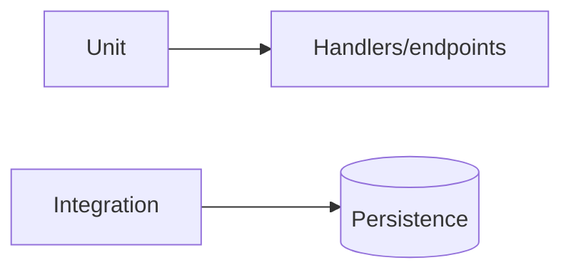

# Notification Service — Testing

## Mục đích

Notification có unit và integration test cho handler, endpoint, lease và persistence.

## Kiến trúc



## Cách dùng

```bash
dotnet test backend/Services/Notification/NotificationService.UnitTests
dotnet test backend/Services/Notification/NotificationService.IntegrationTests
```

## Đã triển khai hiện tại

Có batch handler/endpoint/media-reference unit test và lease integration test.

## Định hướng/chưa triển khai

Không thấy component test project riêng hoặc E2E delivery provider test.

## Troubleshooting

| Hiện tượng | Cách xử lý |
| --- | --- |
| Lease test fail | Kiểm tra database fixture và concurrency assumptions. |
