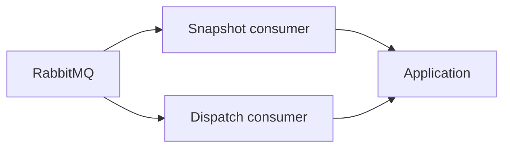

# Notification Service — Worker

## Mục đích

Worker nhận Snapshot và Dispatch command để xử lý batch ngoài HTTP request.

## Kiến trúc

## Cách dùng

Đăng ký consumer Definitions tại Worker host qua BuildingBlocks Messaging.

## Đã triển khai hiện tại

Có `SnapshotNotificationBatchConsumer` và `DispatchNotificationBatchConsumer`.

## Định hướng/chưa triển khai

Scheduler không sở hữu recipient/content và không thay Worker dispatch.

## Troubleshooting

| Hiện tượng | Cách xử lý |
| --- | --- |
| Batch kẹt | Kiểm tra RabbitMQ consumer, lease/repository state và retry logs. |
