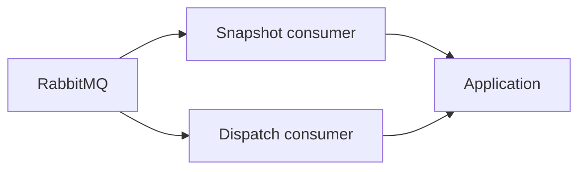

# Notification Service — Worker

## Mục đích

Worker nhận Snapshot và Dispatch command để xử lý batch ngoài HTTP request.

## Kiến trúc

## Cách dùng

Đăng ký consumer Definitions tại Worker host qua BuildingBlocks Messaging.

## Đã triển khai hiện tại

Có `SnapshotNotificationBatchConsumer` và `DispatchNotificationBatchConsumer`.
Mỗi command snapshot/dispatch đều được shared `WorkerConsumeLoggingObserver` ghi
`Received`, `Completed` hoặc `Failed` với queue, correlation và retry metadata;
operator không cần thêm log thủ công vào từng consumer để biết message đã vào hay
đã kết thúc. Payload recipient/content không được ghi vào log.

## Định hướng/chưa triển khai

Scheduler không sở hữu recipient/content và không thay Worker dispatch.

## Troubleshooting

| Hiện tượng | Cách xử lý |
| --- | --- |
| Batch kẹt | Kiểm tra RabbitMQ consumer, lease/repository state và retry logs. |
| Snapshot/dispatch lỗi | Lọc `WorkerEvent=Failed` theo `CorrelationId` hoặc `MessageId`, xem exception và `RetryAttempt/RetryLimit`, rồi đối chiếu batch/lease trong database. |
