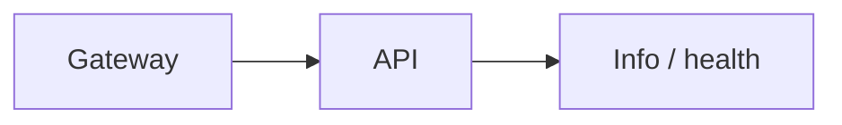

# Scheduler Service — API

## Mục đích

API là HTTP composition root của Scheduler.

## Kiến trúc

## Cách dùng

Host chạy migration và map shared info/health endpoint.

## Đã triển khai hiện tại

`Program.cs` hiện map health/info, không map job CRUD/runtime execution endpoint.

## Định hướng/chưa triển khai

Không suy diễn API quản lý schedule từ schema.

## Troubleshooting

| Hiện tượng | Cách xử lý |
| --- | --- |
| 404 job route | Route chưa được map; không dùng schema làm contract. |
