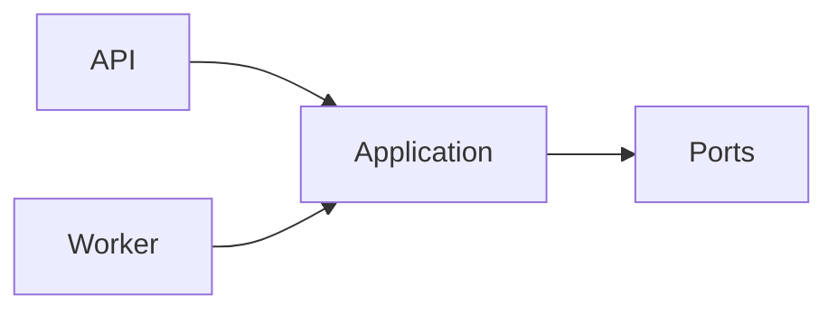

# Scheduler Service — Application

## Mục đích

Application là boundary use case/port cho Scheduler.

## Kiến trúc

## Cách dùng

API/Worker chỉ gọi Application; adapter được đăng ký ngoài layer.

## Đã triển khai hiện tại

Project Application tồn tại nhưng chưa có handler Cron/poll/claim runtime source.

## Định hướng/chưa triển khai

Không tài liệu hóa job execution như behavior đã chạy.

## Troubleshooting

| Hiện tượng | Cách xử lý |
| --- | --- |
| Cần job handler | Thiết kế command/port và idempotency trước khi thêm worker. |
