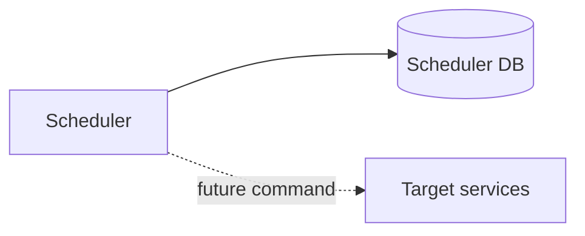

# Scheduler Service — Database và integration

## Mục đích

Scheduler DB chỉ sở hữu background jobs/runs, không sở hữu payload nghiệp vụ service khác.

## Kiến trúc

## Cách dùng

Mọi gọi target service phải qua contract HTTP/message, không cross-query database.

## Đã triển khai hiện tại

Schema/migration/DbContext có mặt; chưa có target-service execution adapter.

## Định hướng/chưa triển khai

Không tạo distributed transaction giữa Scheduler và target service.

## Troubleshooting

| Hiện tượng | Cách xử lý |
| --- | --- |
| Cần gọi target | Xác định command ownership/idempotency trước khi tích hợp. |
