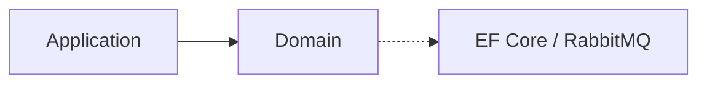

# Scheduler Service — Domain

## Mục đích

Domain là boundary cho BackgroundJob và BackgroundJobRun, không chứa Cron engine hay transport.

## Kiến trúc

## Cách dùng

Application định nghĩa job state qua Domain; persistence implementation ở Infrastructure.

## Đã triển khai hiện tại

Project Domain tồn tại, persistence model hiện được scaffold tại Infrastructure.

## Định hướng/chưa triển khai

Cron evaluation/next-run rule chưa được source hiện thực.

## Troubleshooting

| Hiện tượng | Cách xử lý |
| --- | --- |
| Domain cần DB | Dùng Application port, không dùng DbContext. |
