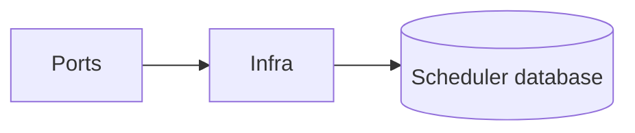

# Scheduler Service — Infrastructure

## Mục đích

Infrastructure cung cấp SchedulerDbContext, migration và database health probe.

## Kiến trúc

## Cách dùng

Đăng ký Infrastructure tại API/Worker composition root.

## Đã triển khai hiện tại

Có `SchedulerDbContext`, scaffolded BackgroundJob/BackgroundJobRun và health probe.

## Định hướng/chưa triển khai

Không có persistent claim/poll adapter được chứng minh.

## Troubleshooting

| Hiện tượng | Cách xử lý |
| --- | --- |
| Health fail | Kiểm tra Scheduler connection string và migration. |
