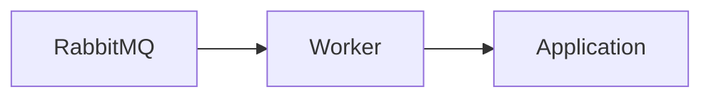

# Scheduler Service — Worker

## Mục đích

Worker là host MassTransit của Scheduler, tách khỏi HTTP host.

## Kiến trúc

## Cách dùng

Worker đăng ký DI/messaging tại `Program.cs`; handler chỉ được thêm khi contract rõ.

## Đã triển khai hiện tại

Worker host project tồn tại, chưa có Cron/poll/claim consumer/handler source.

## Định hướng/chưa triển khai

Job scheduling/execution chưa phải runtime behavior.

## Troubleshooting

| Hiện tượng | Cách xử lý |
| --- | --- |
| Worker không làm việc | Phân biệt host có mặt với handler/consumer chưa được triển khai. |
