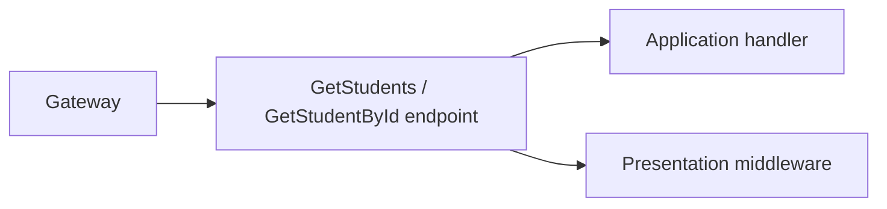

# Student Service — API

## Mục đích

API map Student list/detail query qua Gateway và áp dụng shared response/middleware.

## Kiến trúc

## Cách dùng

Endpoint registration nằm `StudentEndpoints`, request path dùng contract route
trong BuildingBlocks khi phù hợp.

## Đã triển khai hiện tại

`Program.cs` map list và detail endpoints, service info/database health, migration
và OpenAPI; source endpoint gọi Application handler.

## Định hướng/chưa triển khai

Authn/authz policy và write endpoint chưa được suy diễn từ list/detail endpoint.

## Troubleshooting

| Hiện tượng | Cách xử lý |
| --- | --- |
| Response khác envelope | Dùng shared Presentation factory/middleware tại host. |
