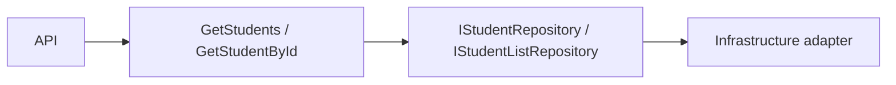

# Student Service — Application

## Mục đích

Application thực hiện Student list/detail query và định nghĩa repository port.

## Kiến trúc

## Cách dùng

API gọi handler bằng DI; handler trả result DTO, còn API chịu trách nhiệm HTTP
mapping/envelope.

## Đã triển khai hiện tại

Có `GetStudentsHandler`, `GetStudentByIdHandler`, query/result, validation error
và các repository interface cho list/detail.

## Định hướng/chưa triển khai

Không coi create/update/delete Student là runtime behavior khi source chỉ có query.

## Troubleshooting

| Hiện tượng | Cách xử lý |
| --- | --- |
| Handler khó test | Depend vào repository interface, không dùng DbContext trực tiếp. |
