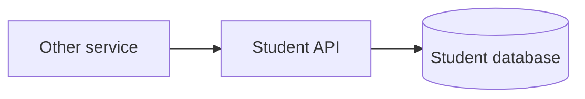

# Student Service — Database và integration

## Mục đích

Student Service sở hữu Student/profile database và là query boundary cho service
khác; caller chỉ nhận contract response, không có quyền join database này.

## Kiến trúc

## Cách dùng

Caller đăng ký typed query client qua `BuildingBlocks.Http`; không tham chiếu
`StudentDbContext` từ service khác.

## Đã triển khai hiện tại

Schema/migration và API query boundary tồn tại; `StudentQueryResponse` là shared
contract hỗ trợ tra cứu ở boundary.

## Định hướng/chưa triển khai

Không có shared database/read replica contract được công bố.

## Troubleshooting

| Hiện tượng | Cách xử lý |
| --- | --- |
| Caller cần Student | Gọi list/detail contract thay vì thêm project reference DB. |
