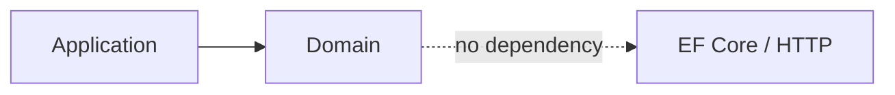

# Student Service — Domain

## Mục đích

`StudentService.Domain` giữ boundary model Student/profile, tách khỏi EF Core và
HTTP để Application có thể áp dụng rule mà không biết transport.

## Kiến trúc

## Cách dùng

Handler Application dùng Domain type/rule; repository abstraction nằm ở
Application, implementation nằm Infrastructure.

## Đã triển khai hiện tại

Project Domain độc lập tồn tại; Student persistence model hiện ở Infrastructure
scaffolded source, nên không suy diễn aggregate behavior chưa có source.

## Định hướng/chưa triển khai

Không thêm foreign key hoặc knowledge về Course/Media database vào Domain.

## Troubleshooting

| Hiện tượng | Cách xử lý |
| --- | --- |
| Domain cần dữ liệu ngoài | Đưa port vào Application và adapter vào Infrastructure. |
