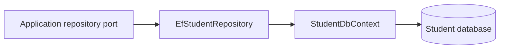

# Student Service — Infrastructure

## Mục đích

Infrastructure hiện thực repository EF Core, `StudentDbContext`, health probe và
migration support cho Student database.

## Kiến trúc

## Cách dùng

Đăng ký `StudentService.Infrastructure.DependencyInjection` tại API host; không
để endpoint dùng DbContext trực tiếp.

## Đã triển khai hiện tại

Có `EfStudentRepository`, `StudentDbContext`, scaffolded Student model và
`StudentDatabaseHealthProbe`.

## Định hướng/chưa triển khai

Không có cross-service database adapter; external profile provider chưa được
chứng minh trong source.

## Troubleshooting

| Hiện tượng | Cách xử lý |
| --- | --- |
| Query fail | Kiểm tra connection string, migration và mapping scaffolded. |
