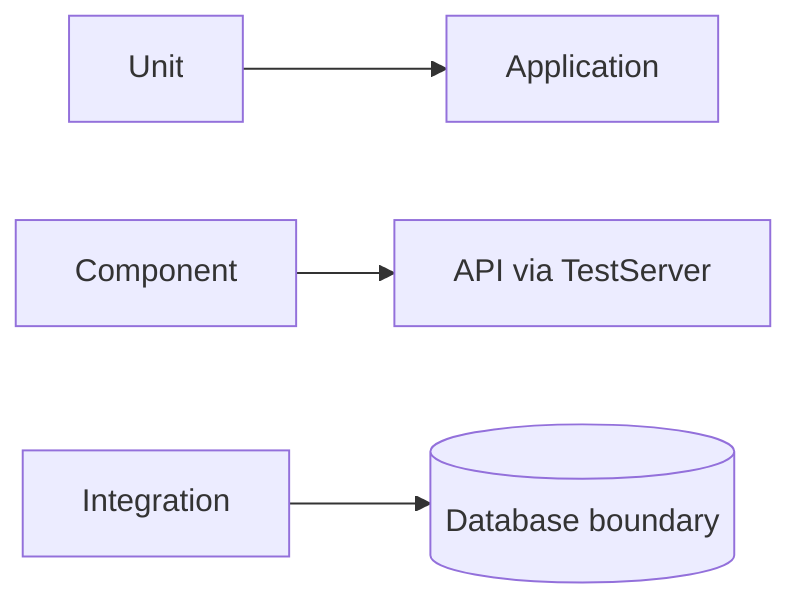

# Student Service — Testing

## Mục đích

Student có Unit, Component và Integration test project để tách logic, HTTP
boundary và persistence boundary.

## Kiến trúc



## Cách dùng

```bash
dotnet test backend/Services/Student/StudentService.UnitTests
dotnet test backend/Services/Student/StudentService.ComponentTests
dotnet test backend/Services/Student/StudentService.IntegrationTests
```

## Đã triển khai hiện tại

Ba test layer project đều tồn tại, gồm component endpoint tests và persistence
integration tests.

## Định hướng/chưa triển khai

Không có E2E test frontend-to-Gateway trong Student test projects này.

## Troubleshooting

| Hiện tượng | Cách xử lý |
| --- | --- |
| Integration test fail | Kiểm tra dependency database/container theo fixture. |
