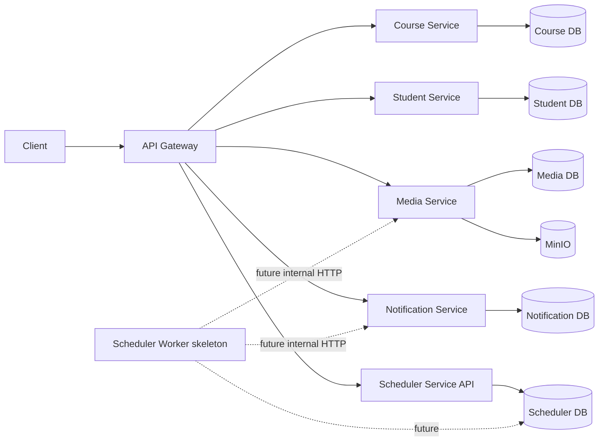

# 4. Kiến trúc Microservices đề xuất

Hệ thống có **4 business services** và **1 platform service** là Scheduler. Media Service sở hữu MinIO; Scheduler sở hữu metadata lịch chạy generic nhưng không sở hữu dữ liệu nghiệp vụ của service khác.



---
# 5. Phân chia Service

## 5.1. Course Service

Chịu trách nhiệm:

- Course
- Lesson
- Enrollment
- Lesson Progress
- Markdown source for Course description and Lesson content
- CSV Export
- N+1 demo
- Index demo
- Pagination demo
- Query Plan demo

### Tables

```text
courses
lessons
enrollments
lesson_progresses
```

---

## 5.2. Student Service

Chịu trách nhiệm:

- User/Student
- Student profile
- Student lookup

### Tables

```text
students
```

Có thể seed:

- 3,000 students
- 10,000 students
- 100,000 students

để test batch.

---

## 5.3. Media Service

Chịu trách nhiệm:

- Upload/download object với MinIO.
- Metadata cho image, video, document, audio và các loại media khác.
- Presigned/proxy URL, content type validation, size limit, và soft delete.
- Liên kết media với Course description, Lesson content, Notification body, thumbnail hoặc attachment.
- Quản lý `media_usages`; Course và Notification Service không truy cập MinIO hoặc Media database trực tiếp.

### Tables

```text
media_objects
media_usages
```

---

## 5.4. Notification Service

Chịu trách nhiệm:

- Broadcast notification
- Gửi notification đơn lẻ
- In-app inbox và read status của student
- Notification batch data and recipient-level delivery state
- Retry
- Idempotency
- Failure tracking
- Batch benchmark

### Tables

```text
notification_batches
notification_batch_items
notifications
```

---

## 5.5. Scheduler Service

Scheduler là platform boundary cho định nghĩa job generic và lịch sử từng run:

- Lịch `MANUAL` hoặc `CRON`.
- Trạng thái cấu hình, timeout, retry và concurrency metadata.
- Run history, idempotency key, correlation và error/output metadata.
- API health và Worker skeleton trong phase hiện tại.

```text
background_jobs
background_job_runs
```

Scheduler không query `lms_media_db` hoặc `lms_notification_db`. CRON parsing, claim lock, handler execution và internal HTTP calls là follow-up.

---
# 6. Vì sao là 4 business services và 1 platform service?

Trong 5 ngày:

```text
User Service
Course Service
Lesson Service
Enrollment Service
Progress Service
Notification Service
Export Service
```

là **over-engineering**.

Microservice không có nghĩa là mỗi entity thành một service.

Boundary nên theo **business capability**:

```text
Course Service
Student Service
Media Service
Notification Service
Scheduler Service (platform)
```

Đủ để:

- Có service boundary.
- Có database ownership.
- Có network communication.
- Có Docker network.
- Có Clean Architecture bên trong từng service.
- Không làm mất 3 ngày chỉ để cấu hình infrastructure.

---
# 7. Database ownership

Nguyên tắc:

> Mỗi service sở hữu database/schema của riêng nó.

Trong demo có thể dùng **một MySQL container**, nhưng tạo database riêng:

```text
lms_course_db
lms_student_db
lms_media_db
lms_notification_db
lms_scheduler_db
```

Không nên:

```text
Course Service
    │
    └── query trực tiếp students table
```

Nên:

```text
Course Service
    │
    └── HTTP → Student Service
```

Tương tự, Course Service và Notification Service chỉ gọi HTTP tới Media Service để upload, lấy URL, hoặc đăng ký `media_usages`; tuyệt đối không gọi MinIO hay query `lms_media_db` trực tiếp.

Trong Scheduler foundation chưa có cross-service contract. Phase execution sau mới gọi internal HTTP endpoint của service sở hữu nghiệp vụ; không mở rộng sang event bus hoặc query chéo database.

---
