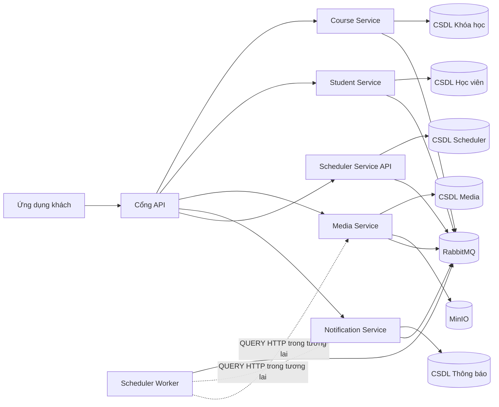

# 4. Kiến trúc vi dịch vụ đề xuất

Hệ thống có **4 dịch vụ nghiệp vụ** và **1 dịch vụ nền tảng** là Scheduler. Media Service sở hữu MinIO; Scheduler sở hữu siêu dữ liệu lịch chạy dùng chung nhưng không sở hữu dữ liệu nghiệp vụ của dịch vụ khác.



---
# 5. Phân chia dịch vụ

## 5.1. Course Service

Chịu trách nhiệm:

- Khóa học
- Bài học
- Ghi danh
- Tiến độ Bài học
- Mã nguồn Markdown cho mô tả Khóa học và nội dung Bài học
- Xuất CSV
- Minh họa N+1
- Minh họa chỉ mục
- Minh họa phân trang
- Minh họa kế hoạch truy vấn

### Các bảng

```text
courses
lessons
enrollments
lesson_progresses
```

---

## 5.2. Student Service

Chịu trách nhiệm:

- Người dùng/Học viên
- Hồ sơ Học viên
- Tra cứu Học viên

### Các bảng

```text
students
```

Có thể tạo dữ liệu mẫu:

- 3,000 students
- 10,000 students
- 100,000 students

để kiểm thử xử lý hàng loạt.

---

## 5.3. Media Service

Chịu trách nhiệm:

- Tải lên/tải xuống đối tượng bằng MinIO.
- Siêu dữ liệu cho hình ảnh, video, tài liệu, âm thanh và các loại media khác.
- URL ký trước/URL proxy, xác thực loại nội dung, giới hạn kích thước và xóa mềm.
- Liên kết media với mô tả Khóa học, nội dung Bài học, nội dung Thông báo, ảnh đại diện hoặc tệp đính kèm.
- Quản lý `media_usages`; Course Service và Notification Service không truy cập trực tiếp MinIO hoặc cơ sở dữ liệu Media.

### Các bảng

```text
media_objects
media_usages
```

---

## 5.4. Notification Service

Chịu trách nhiệm:

- Phát thông báo hàng loạt
- Gửi thông báo đơn lẻ
- Hộp thư đến trong ứng dụng và trạng thái đọc của Học viên
- Dữ liệu lô Thông báo và trạng thái phân phối của từng người nhận
- Thử lại
- Tính lũy đẳng
- Theo dõi lỗi
- Đo kiểm hiệu năng xử lý hàng loạt
- Claim recipient batch bằng lease trong Notification DB để nhiều Notification
  Worker có thể xử lý song song mà không sở hữu chồng item

### Các bảng

```text
notification_batches
notification_batch_items
notifications
```

---

## 5.5. Scheduler Service

Scheduler là ranh giới nền tảng cho định nghĩa tác vụ dùng chung và lịch sử từng lượt chạy:

- Lịch `MANUAL` hoặc `CRON`.
- Siêu dữ liệu trạng thái cấu hình, thời gian chờ, số lần thử lại và xử lý đồng thời.
- Lịch sử lượt chạy, khóa lũy đẳng, mã tương quan và siêu dữ liệu lỗi/kết quả.
- API kiểm tra trạng thái và khung Worker trong giai đoạn hiện tại.

```text
background_jobs
background_job_runs
```

Scheduler không truy vấn `lms_media_db` hoặc `lms_notification_db`. Worker đã
được host cùng MassTransit nhưng việc phân tích CRON, khóa nhận xử lý, job
handler và message contract nghiệp vụ sẽ được triển khai sau.

---
# 6. Vì sao là 4 dịch vụ nghiệp vụ và 1 dịch vụ nền tảng?

Trong 5 ngày:

```text
Dịch vụ người dùng
Course Service
Dịch vụ bài học
Dịch vụ ghi danh
Dịch vụ tiến độ
Notification Service
Dịch vụ xuất dữ liệu
```

là **thiết kế quá mức cần thiết**.

Vi dịch vụ không có nghĩa là mỗi thực thể trở thành một dịch vụ.

Ranh giới nên dựa trên **năng lực nghiệp vụ**:

```text
Course Service
Student Service
Media Service
Notification Service
Scheduler Service (nền tảng)
```

Đủ để:

- Có ranh giới dịch vụ.
- Có quyền sở hữu cơ sở dữ liệu.
- Có giao tiếp qua mạng.
- Có mạng Docker.
- Có kiến trúc sạch bên trong từng dịch vụ.
- Không mất 3 ngày chỉ để cấu hình hạ tầng.

---
# 7. Quyền sở hữu cơ sở dữ liệu

Nguyên tắc:

> Mỗi dịch vụ sở hữu cơ sở dữ liệu/lược đồ riêng.

Trong bản trình diễn có thể dùng **một container MySQL**, nhưng tạo cơ sở dữ liệu riêng:

```text
lms_course_db
lms_student_db
lms_media_db
lms_notification_db
lms_scheduler_db
```

Không nên:

```text
Course Service
    │
    └── truy vấn trực tiếp bảng students
```

Nên:

```text
Course Service
    │
    └── HTTP → Student Service
```

Tương tự, Course Service và Notification Service không gọi MinIO hay truy vấn `lms_media_db` trực tiếp. QUERY tải lên/lấy URL dùng HTTP; command đăng ký `media_usages` của Notification dùng RabbitMQ + transactional outbox để tránh dual-write.

Foundation giao tiếp liên service dùng HTTP cho QUERY cần response ngay,
RabbitMQ `Send` cho COMMAND và RabbitMQ `Publish` cho EVENT. Scheduler chưa có
message contract nghiệp vụ; contract sẽ chỉ được thêm cùng use case thật. Không
truy vấn chéo database. Xem
[`service-communication.md`](service-communication.md).

---
